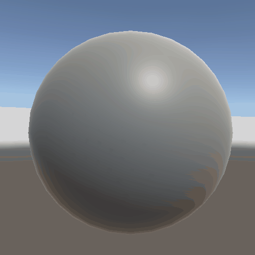

# ShaderTown
A slow drive through Shader Town, Unity Shader Graph testing project

## Unity Specifications

I am using the *Universal RP* and *Shader Graph* packages on Unity 2020.3.21f1.

## Universal RP Setup

Start by creating a new asset :  
**Create > Rendering > Universal Render Pipeline > Pipeline Asset (Forward Renderer)**

Now you can set your project to use the newly created Pipeline :  
**Edit > Project Settings > Graphics > Scriptable Render Pipeline Settings** and select the newly created *UniversalRenderPipelineAsset*.

To set up Post Processing effects, you need to configure your scene's main camera :  
**Main Camera > Camera [Component] > Rendering > Post Processing** and tick it.

## Creating a new Shader

To create a new shader using Unity Shader Graph :  
**Create > Shader > Universal Render Pipeline > \*\*\* Shader Graph**  
You can now open this shader asset and edit it's graph.

## Shaders Specifications

Here are some of the attributes used by the shader and what they are :
- **Base Color(3)** : base color of the surface
- **Normal (Tangent Space)(3)** : normal of the fragment, *Tangent Space* being the default one
- **Metallic(1)** : determines how "metal-like" the surface is [[Metallic Parameter]](https://docs.unity3d.com/Manual/StandardShaderMaterialParameterMetallic.html)
- **Smoothness(1)** : low smoothness determines a matte surface whereas high smoothness determines a mirror surface [[Smoothness]](https://docs.unity3d.com/Manual/StandardShaderMaterialParameterSmoothness.html)
- **Emission(3)** : makes a surface appear as a visible source of light [[Emission]](https://docs.unity3d.com/Manual/StandardShaderMaterialParameterEmission.html)
- **Ambient Occlusion(1)** : approximates how much ambient light can hit a point on the surface [[Ambient Occlusion]](https://docs.unity3d.com/Manual/LightingBakedAmbientOcclusion.html)

*NB* : *Attribute(x)* means the attribute contains x axis on its value, much like x-dimension vectors.

## Applying a Shader to a GameObject

To apply a shader to a GameObject, you need to create a new Material to hold that shader :
**Create > Material**  
And then choose the corresponding shader :  
**Shader > Shader Graphs > \*\*\***  
You will be able to modify the shader's properties from the material directly.

## Shaders

### Glowing Shader

A glowing shader using a Fresnel Effect node and the Sine of time.  
Fresnel Effect adds a aura effect, applied to the Emission it acts as a glowing aura surrounding the object.  
The Sine of time, remapped from [-1, 1] to [0.1, 1], makes it dynamic.

*BaseColor* and *GlowColor* are both properties of the shader, enabling one to edit them outside of the shader graph.

### Voronoi Shader

Using Voronoi I created a moving set of cells. The moving effect is accomplished by setting the *AngleOffset* property of Voronoi to *Time* being the time elapsed.  
I then multiplied it by an intensity factor and a color property.

